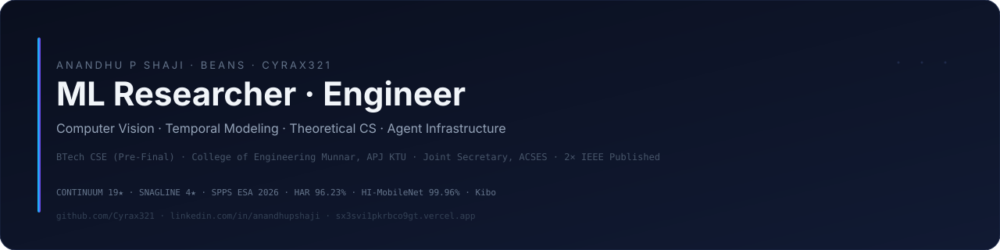

<div align="center">
  
</div>

<div align="center">

# Anandhu P Shaji - Beans
**ML Researcher · BTech CSE, CEM Munnar (APJ KTU) · Joint Secretary, ACSES**

<a href="https://linkedin.com/in/anandhupshaji"></a>
<a href="mailto:cyrax8590@gmail.com"></a>
<a href="https://sx3svi1pkrbco9gt.vercel.app/"></a>
<a href="https://github.com/Cyrax321"></a>

<br/>

<a href="https://ieeexplore.ieee.org/document/11291542"></a>
<a href="https://ieeexplore.ieee.org/document/11332605"></a>

<sub>2x IEEE as undergrad · 159 repos · TensorFlow contributor · CONTINUUM 19★ · SNAGLINE 4★</sub>

</div>

---

## Founder Note

I build research that ships. Pre-final CSE, I benchmark models from scratch in PyTorch and turn them into production systems in TypeScript. Goal is simple: master Theoretical CS and ship useful infrastructure. `i love learning`.

---

## Research

**Two IEEE papers as undergrad. All code is review only and reproducible.**

**Paper 1: HAR from Video** - IEEE PICC 2025 - [DOI 11291542](https://ieeexplore.ieee.org/document/11291542) - Palliparambil, Shaji, Rajan  
7 class video HAR on 1,113 videos. Tested 3D CNN, CNN-LSTM, VideoMAE, V-JEPA2. CNN-LSTM wins at 96.23% accuracy and 0.9628 F1. Point is that convolutional recurrent fusion beats transformers when data is scarce. Code: [HAR-Sample-Efficient-Activity-Recognition](https://github.com/Cyrax321/HAR-Sample-Efficient-Activity-Recognition)

**Paper 2: HI-MobileNet** - IEEE - [DOI 11332605](https://ieeexplore.ieee.org/document/11332605)  
Harlequin Ichthyosis is ultra rare and data is tiny. MobileNetV2 with transfer learning hits 99.96%. Lightweight and deployable. Code ref: [H-CoAtNet-Ichthyosis-Models](https://github.com/Cyrax321/H-CoAtNet-Ichthyosis-Models)

### Codebases

| Repo | What it does | Stack | Result | Link |
|:---|:---|:---|:---|:---|
| HAR-Sample-Efficient-Activity-Recognition | 7 class video HAR benchmark | Python, TensorFlow, PyTorch | CNN-LSTM 96.23% | [repo](https://github.com/Cyrax321/HAR-Sample-Efficient-Activity-Recognition) |
| H-CoAtNet-Ichthyosis | Hybrid CNN Transformer for 5 ichthyosis subtypes on 1,580 images | Python, PyTorch, timm, Roboflow | Conv stem plus Transformer plus SE | [repo](https://github.com/Cyrax321/H-CoAtNet-Ichthyosis) |
| wave-coAtNet | Wavelet enhanced successor with cross attention and prototype selection | Python, PyTorch | 13 model kappa, 5 fold CV | [repo](https://github.com/Cyrax321/wave-coAtNet) |
| H-CoAtNet-Ichthyosis-Classification | Training harness for WaveCoAtNet | Python | 7 pretrained plus scratch baselines | [repo](https://github.com/Cyrax321/H-CoAtNet-Ichthyosis-Classification) |
| SPPS-Mac-Os-Code-Base | SPPS primary benchmark on Apple M1 arm64 | C++17, Protobuf 34, FlatBuffers 25 | 8 blocks vs LOUDS, FlatBuffers, Protobuf | [repo](https://github.com/Cyrax321/SPPS-Mac-Os-Code-Base) |
| spps-linux-experiment-results | SPPS cross platform validation on EPYC 7763 Ubuntu 24.04 | C++, GCC 13.3 | 12006 of 12006 PASS | [repo](https://github.com/Cyrax321/spps-linux-experiment-results) |
| spps-experiments | SPPS ESA 2026 Track E submission on Ryzen 5 7235HS | C++, GCC 11 | Bijective O(n) encoding | [repo](https://github.com/Cyrax321/spps-experiments) |

SPPS is a novel O(n) tree serialization that extends Prufer with direction and rank. Three repos are one project with different hardware. 8 blocks are correctness, linearity, real data bench, LOUDS, compression, tail latency, downstream, worked examples.

---

## Building Now

### CONTINUUM - Verifiable recovery for long running agents
[Cyrax321/CONTINUUM](https://github.com/Cyrax321/CONTINUUM) - 19 stars, 15 forks, Apache 2.0, Python 3.11 - [Live Demo](https://continuum-nu-six.vercel.app)

Agents crash after hundreds of calls and replay duplicates work. CONTINUUM lets them resume from a compact verified checkpoint.

Core ideas are semantic checkpoints not transcript dumps, environment revalidation before resume, and provenance aware state where agent claims are marked requires review. Ledger is two phase claim then complete, log is hash chained with 32 event types, MCP server has 10 tools with deny by default, adapters cover Generic Python, OpenAI Agents SDK, LangGraph, LangChain, Docker, K8s, Browser. Verified on Claude Code Opus 4.8 with 7 of 7 mechanics and 1038 tests passing.

```python
from continuum import Run, SQLiteStorage, project
store = SQLiteStorage("agent.db")
store.create_run(Run(run_id="run_4821", goal="Analyze 10,000 documents"))
state = project("run_4821", store.read_events("run_4821"))
assert store.verify_events("run_4821").ok
```

### SNAGLINE - Realtime failure detection for agents
[Cyrax321/SNAGLINE](https://github.com/Cyrax321/SNAGLINE) - 4 stars, 3 forks, MIT, Python 3.10

Zero dependency O(1) per step monitor that costs about 1 microsecond. Fail open so it never crashes the host. Watches loops, error cascades, latency drift with CUSUM, plus opt in goal drift and ML ensemble. Sinks are console and webhook only. No content retention. Median 1.9 microsecond per step, p99 33.9 microsecond over 200k steps.

```python
from snagline import Monitor
from snagline.adapters.raw import watch
monitor = Monitor.default()
with watch(monitor, "ep-1") as step:
    step("tool_call", tool_name="search", args="query", latency_ms=120, error=False)
```

SNAGLINE detects. CONTINUUM recovers. Built to run together.

---

## Kibo

[kibo-v7-](https://github.com/Cyrax321/kibo-v7-) - TypeScript - Career Orchestration Platform

Gamified platform to run the SWE hiring pipeline. React 18 plus Vite plus TanStack Query on the frontend, PostgreSQL with Supabase Realtime logical replication on the backend with sub 100ms CDC, Tailwind plus Shadcn plus Recharts for the Garden contribution graph and leaderboard. Event bus, gamification protocol with XP and streaks, mission control analytics. Build passing, v5.0.0, MIT. This is the canonical repo, 12 plus kibo variants are history.

---

## Open Source

**TensorFlow** - [Cyrax321/tensorflow](https://github.com/Cyrax321/tensorflow) fork of tensorflow/tensorflow

25 fix branches, all authored as Cyrax321 or Beans. Branch stage, behind upstream about 1793 on master as of Aug 2026, awaiting review.

| Fix | Commit | Summary |
|:---|:---|:---|
| tf.nn.weighted_moments | a7a234b | Fix TypeError when axes is Tensor or ndarray. Normalize via constant_value and tolist. Add 3 tests. Fix Bazel deps |
| tf.linalg.det gradient | 2033cc7 | Fix singular crash. Use SVD det times A inverse H plus pinv instead of matrix_inverse |
| top_k int64 | d511f44 | Fix hardcoded int32 offset. Use dynamic index_type |
| Grappler ArgMax | 1581c76 | Fix wrong results for saturating ops in float32 |
| igamma NaN | 713375a | Fix a less equal 0 to not a greater than 0 for NaN. Add graph and eager Jacobian test |

Plus 20 cleanups: floordiv MLIR, logsumexp, reciprocal involution, numpy cross XLA, sparse adagrad, speech commands, typo sweeps, cmake.

Browse any fix at `github.com/Cyrax321/tensorflow/tree/fix-weighted-moments-tensor-axes`

---

## Stack

Python · PyTorch · TensorFlow · C++ · TypeScript · React · PostgreSQL · Supabase · OpenCV · scikit-learn · MCP

---

<div align="center">


**Portfolio** https://sx3svi1pkrbco9gt.vercel.app/ · **LinkedIn** https://linkedin.com/in/anandhupshaji · **Email** cyrax8590@gmail.com · CEM Kerala

<sub>Last updated Aug 2026 · github.com/Cyrax321</sub>

</div>
