 

&nbsp;

&nbsp;

&nbsp;

---

<b>📄 Paper 1 — HAR from Video · CNN-LSTM · 96.23%</b>

 

**Deep Temporal Representation Learning for Sample-Efficient HAR from Video Sequences**

Benchmarked 3D CNN · CNN-LSTM · VideoMAE · V-JEPA2 on a 7-class activity dataset.
CNN-LSTM achieved **96.23% accuracy**.

<b>🧬 Paper 2 — Rare Skin Disease · MobileNetV2 · 99.96%</b>

 

**HI-MobileNet: Lightweight DL for Automated Diagnosis of Harlequin Ichthyosis**

Transfer learning for an ultra-rare condition under limited data.
MobileNetV2 achieved **99.96% accuracy**.

<b>🏗️ Projects — click to expand</b>

 

| Project | Stack | Highlight |
|:---|:---|:---|
| **KIBO** — Gamified Career Platform | React · TypeScript · Supabase | 99.3% test pass · 293 cases |
| **H-CoAtNet** — Hybrid CNN-Transformer | PyTorch (from scratch) | 90.51% · Beat Swin + ViT |
| **HAR System** — Architecture Benchmark | PyTorch · 7-class video | CNN-LSTM best at 96.23% |
| **MobileNetV2 Classifier** | TensorFlow · Transfer learning | Strong under limited data |

